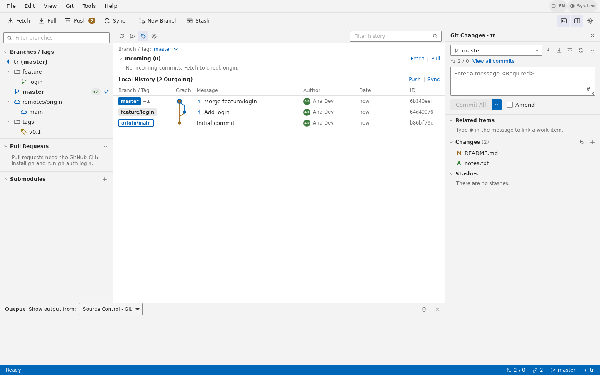

# GitDesk

Cliente Git de escritorio para Linux inspirado en las herramientas de control de versiones de Visual Studio: árbol de ramas, historial con gráfico de commits y el panel **Git Changes** acoplado (Fetch / Pull / Push / Sync, commit, amend, stage, stashes), con menús contextuales equivalentes a los de VS.



- **Tauri v2 + Rust** en el backend: ejecuta el `git` real del sistema (sin reimplementar Git).
- **Vite + TypeScript** (sin framework) en el frontend, portado del prototipo aprobado.
- Temas oscuro / claro / sistema, interfaz en **español e inglés** (los verbos de Git se mantienen en inglés, igual que en VS).
- Modo **demo** con un repositorio en memoria: se abre solo cuando corres la app en el navegador.

## Requisitos

| Herramienta | Versión |
|---|---|
| Node.js | 18 o superior (probado con 22) |
| Rust (rustup) | estable, 1.77+ |
| git | 2.30+ (en el PATH) |
| curl | cualquiera (lee el perfil de GitHub al iniciar sesión) |
| gh (opcional) | GitHub CLI, solo para Pull Requests |

Dependencias del sistema para Tauri (Debian / Ubuntu):

```bash
sudo apt update
sudo apt install -y libwebkit2gtk-4.1-dev build-essential curl wget file \
  libxdo-dev libssl-dev libayatana-appindicator3-dev librsvg2-dev
```

Fedora: `sudo dnf install webkit2gtk4.1-devel openssl-devel curl wget file libappindicator-gtk3-devel librsvg2-devel && sudo dnf group install "c-development"`
Arch: `sudo pacman -S webkit2gtk-4.1 base-devel curl wget file openssl appmenu-gtk-module libappindicator-gtk3 librsvg`

> ¿Trabajas desde Windows? Usa WSL2 (Ubuntu) con WSLg y sigue los mismos pasos dentro de Linux.

## Instalar en Linux (un comando)

Desde la carpeta del proyecto, con tu usuario normal (pedirá `sudo`):

```bash
bash install.sh
```

Instala los paquetes del sistema (apt, dnf o pacman), Node y Rust si faltan, compila GitDesk, lo instala (.deb en Ubuntu/Debian, .rpm en Fedora, binario + lanzador en Arch) y configura Git Credential Manager para *Iniciar sesión* con GitHub. Se puede volver a ejecutar para actualizar.

## Empezar

```bash
npm install

# 1) Solo interfaz, en el navegador, con el repositorio demo
npm run dev            # http://localhost:1420

# 2) App de escritorio con git real (recarga en caliente)
npm run tauri dev

# 3) Paquetes de distribución (.deb, .rpm, .AppImage)
npm run tauri build    # salida en src-tauri/target/release/bundle/
```

Abrir un repositorio directamente desde la terminal:

```bash
gitdesk ~/proyectos/mi-repo
# en desarrollo:
npm run tauri dev -- -- ~/proyectos/mi-repo
```

Si no pasas ruta, GitDesk reabre el último repositorio o muestra la pantalla de bienvenida (Abrir, Clonar, Nuevo, Demo y recientes).

### Otros comandos

```bash
npm run typecheck                        # TypeScript estricto
npm run build                            # tsc + vite build → dist/
cd src-tauri && cargo test               # pruebas del backend contra repos git reales
```

## Credenciales

GitDesk nunca pide contraseñas: ejecuta git con `GIT_TERMINAL_PROMPT=0`. Configura una de estas opciones antes de hacer Push/Pull:

- **SSH**: `ssh-keygen -t ed25519` y agrega la llave pública a GitHub/GitLab; usa remotos `git@…`.
- **HTTPS**: [Git Credential Manager](https://github.com/git-ecosystem/git-credential-manager) o `git config --global credential.helper store` (o `libsecret`).

Si la autenticación falla, verás un aviso en Git Changes y el detalle en el panel **Output**.

**Cuenta de GitHub**: *Iniciar sesión* (barra de menú o pantalla de bienvenida) usa el login de git, no una app OAuth propia: ejecuta `git credential fill` para `https://github.com`. Con Git Credential Manager se abre el inicio de sesión de GitHub en el navegador y el token queda en el llavero del sistema; es la misma credencial que usan Push/Pull, también desde la terminal. GitDesk la usa para leer tu perfil (nombre, usuario y avatar) y puede poner ese nombre y correo en tus commits. *Cerrar sesión* borra esa credencial (`git credential reject`). Si ya hiciste `gh auth login` y `gh auth setup-git`, GitDesk detecta esa sesión al arrancar.

**Pull Requests**: instala `gh` y ejecuta `gh auth login`. Sin `gh`, la sección de PR muestra cómo habilitarla.

## Estructura

```
├─ index.html              # shell de la app (menús, toolbar, paneles)
├─ src/
│  ├─ main.ts              # arranque: tema, eventos, repositorio inicial
│  ├─ core/                # modelo, i18n (es/en), ajustes, iconos, utilidades
│  ├─ backend/             # GitBackend: tauri.ts (git real) y mock.ts (demo)
│  ├─ ui/                  # render, menús contextuales, diálogos, acciones, eventos
│  └─ styles/              # tokens.css (design tokens) y app.css
├─ src-tauri/
│  ├─ src/git.rs           # todas las operaciones git + parsers + pruebas
│  ├─ src/lib.rs           # comandos Tauri expuestos al frontend
│  └─ tauri.conf.json      # ventana, CSP, paquetes deb/rpm/appimage
├─ design/
│  ├─ design-system/       # tokens, componentes y brand book
│  └─ prototype/           # prototipo interactivo (abre el .html en el navegador)
└─ docs/                   # arquitectura, mapa de comandos git, roadmap
```

Más detalle en [docs/ARCHITECTURE.md](docs/ARCHITECTURE.md), [docs/GIT-COMMANDS.md](docs/GIT-COMMANDS.md) y [docs/ROADMAP.md](docs/ROADMAP.md).

## Atajos principales

| Acción | Atajo |
|---|---|
| Commit | Ctrl+Enter (en el mensaje) |
| Fetch | Ctrl+Shift+F |
| Mostrar/ocultar Git Changes | Ctrl+Shift+G |
| Filtrar historial / ramas / Output | Ctrl+F / Ctrl+B / Ctrl+J |
| Abrir repositorio | Ctrl+O |
| Refrescar | F5 |
| Opciones | Ctrl+, |
| Menú contextual de la fila | Shift+F10 |

La lista completa está en *Help → Keyboard shortcuts*.

## Licencia

Todos los derechos reservados — ver [LICENSE](LICENSE). El código es público solo para consulta: no se permite copiarlo, modificarlo, redistribuirlo ni usarlo sin permiso escrito del autor.
